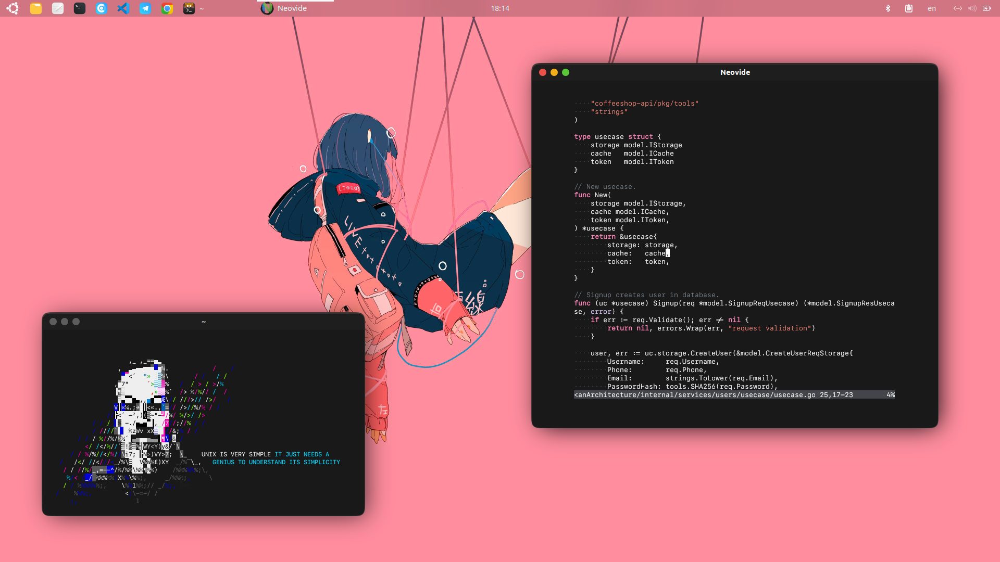

# Dotfiles

My GNOME rice. Inspired by [Who23](https://github.com/Who23/dots).

## Configuration

### Fonts

- **VSCode Font**: [JetBrains Mono](https://www.jetbrains.com/lp/mono/)
- **Terminal Font**: [SF Mono Medium](https://developer.apple.com/fonts/)
- **Gedit Font**: [JetBrains Mono](https://www.jetbrains.com/lp/mono/)
- **System interface Font**: Ubuntu Medium

### Applications

- **VSCode theme**: [Material Theme Darker](https://marketplace.visualstudio.com/items?itemName=Equinusocio.vsc-material-theme), [Panda Syntax](https://marketplace.visualstudio.com/items?itemName=tinkertrain.theme-panda), [Yonce](https://marketplace.visualstudio.com/items?itemName=minamarkham.yonce-theme)
- **Gedit theme**: Yaru Dark
- **Google Chrome theme**: Classic Dark

### Desktop Evnironment

- **Applications theme**: [WhiteSur Dark](https://github.com/vinceliuice/WhiteSur-gtk-theme)
- **Mouse theme**: Yaru
- **Icons theme**: [Reversal Dark](https://github.com/yeyushengfan258/Reversal-icon-theme)
- **Shell theme**: Yaru Blue Dark

### GNOME Extensions

- [Blur my Shell](https://github.com/aunetx/blur-my-shell)
- [Dash to Panel](https://github.com/home-sweet-gnome/dash-to-panel)
- [Rounded Window Corners](https://github.com/yilozt/rounded-window-corners)
- [Pano - Clipboard Manager](https://github.com/oae/gnome-shell-pano)
- [User Themes](https://gitlab.gnome.org/GNOME/gnome-shell-extensions)

### Scripts

- **Ligaturizer**: [github.com/ToxicFrog/Ligaturizer](https://github.com/ToxicFrog/Ligaturizer)
- **Dennis Ritchie ASCII art**: [github.com/LukeSmithxyz/voidrice/blob/master/.local/bin/unix](https://github.com/LukeSmithxyz/voidrice/blob/master/.local/bin/unix)
